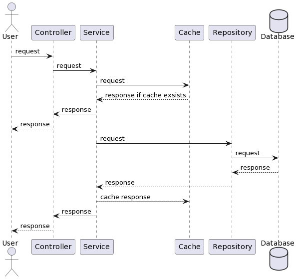
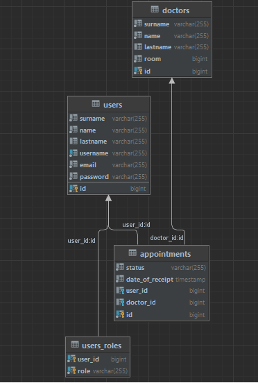

# Pcenter

Это приложение создано для организации онлайн-записи пациентов на прием к врачу в помощь Санкт-Петербургскому центру
рассеянного склероза.

Буду рад конструктивной критике.

Возможность проверить работоспособность: http://localhost:8080/swagger-ui/index.html#/

## Краткое описание структуры

Приложение представляет из себя набор сущностей:

- User
- Doctor
- Appointment

У user имеются роли: ROLE_PATIENT, ROLE_ADMIN

Appointment статус: BUSY, FREE, RECORDED

У администратора имеется возможность по созданию doctor и appointment, которое привязывается к определенному doctor

Пациент может посмотреть список всех врачей, записи со статусом "FREE" и записаться на прием, при этом статус записи
изменится на "RECORDED"

## Диаграмма обращений

## Диаграмма классов

## Окружение:

Для старта необходимо в корне проекта создать файл .env,
где указать необходимые значения:

- 'HOST' - порт для запуска базы данных Postgresql
- 'POSTGRES_USERNAME' - имя пользователя для Postgresql
- 'POSTGRES_PASSWORD' - пароль для Postgresql
- 'POSTGRES_DATABASE' - название базы данных Postgresql
- 'POSTGRES_SCHEMA' - имя схемы базы данных Postgresql
- 'REDIS_PASSWORD' - пароль для Redis
- 'REDIS_HOST' - порт для запуска Redis
- 'JWT_SECRET' - секрет для JWT tokens